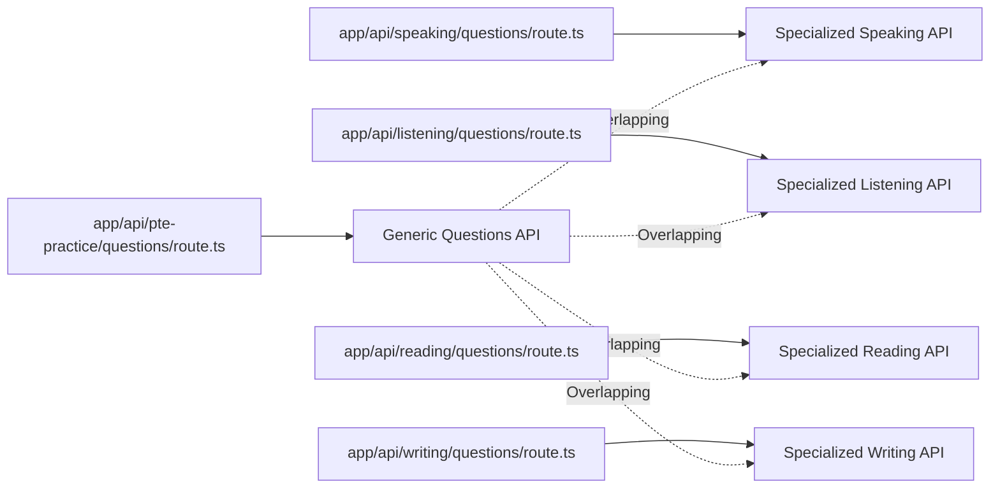

# PTE Practice Platform - Next.js Architecture Assessment

## Executive Summary

This assessment analyzes the Next.js App Router architecture for the PTE (Pearson Test of English) practice platform, identifying critical routing conflicts, data fetching inconsistencies, and performance optimization opportunities.

**Key Findings:**
- 15+ route conflicts identified across practice flows
- Inconsistent data fetching patterns between server/client components
- Missing caching strategies for frequently accessed content
- API route duplication and inconsistent response formats

**Priority Recommendations:**
1. Resolve route conflicts immediately
2. Implement consistent SSR/ISR patterns
3. Standardize API response formats
4. Add comprehensive caching strategy

---

## 1. Current Route Structure Analysis

### 1.1 Dynamic Route Conflicts

The most critical issue is the coexistence of dynamic and static route patterns that create conflicts:

```mermaid
graph TD
    A[pte/academic/practice/[section]/[questionType]/page.tsx] --> B[Universal Handler]
    C[pte/academic/practice/speaking/read-aloud/page.tsx] --> D[Specific Handler]
    E[academic/pte-practice-test/speaking/read-aloud/page.tsx] --> F[Alias Route]
    
    A -.->|Conflict| C
    A -.->|Conflict| E
    C -.->|Alias| F
    
    G[pte/academic/practice/[section]/page.tsx] --> H[Section Landing]
    I[pte/academic/practice/speaking/] --> J[Specific Section]
    
    G -.->|Conflict| J
```

**Identified Conflicts:**

1. **Primary Route Conflict:**
   - `/pte/academic/practice/[section]/[questionType]/page.tsx` (Universal Dynamic)
   - `/pte/academic/practice/speaking/read-aloud/page.tsx` (Specific Static)
   - Both handle the same logical route but with different implementations

2. **Route Aliasing Issues:**
   - `/academic/pte-practice-test/speaking/read-aloud/page.tsx` → Alias to main route
   - Creates maintenance burden and potential SEO confusion

3. **Section Level Conflicts:**
   - `/pte/academic/practice/[section]/page.tsx` (Dynamic Section Landing)
   - `/pte/academic/practice/speaking/page.tsx` (Static Section Landing)

### 1.2 Question Route Patterns

**Inconsistent Question URL Patterns:**

```typescript
// Current mixed patterns
'/pte/academic/practice/speaking/read-aloud/question/[id]'  // Standard
'/pte/academic/practice/listening/fill-in-blanks/question/[id]' // Standard  
'/pte/academic/practice/writing/summarize-written-text/question/[id]' // Standard

// While generic handler expects:
'/pte/academic/practice/[section]/[questionType]/question/[id]'
```

**Route Hierarchy Issues:**
- `/pte/academic/practice/[section]/[questionType]/page.tsx` handles listing
- `/pte/academic/practice/[section]/[questionType]/question/[id]/page.tsx` should handle individual questions
- But specific routes bypass this pattern entirely

---

## 2. Data Fetching Pattern Analysis

### 2.1 Current Implementation Patterns

**Pattern 1: Server-Side API Fetching**
```typescript
// From [section]/[questionType]/page.tsx
const url = new URL(`/api/speaking/questions`, base)
url.searchParams.set('type', speakingType)
const res = await fetch(url, { cache: 'no-store' })
```
- ✅ Server-side rendering
- ❌ No caching strategy
- ❌ Building absolute URLs (complexity)

**Pattern 2: Direct Database Queries**
```typescript
// From read-aloud/question/[id]/page.tsx
const result = await db.select().from(speakingQuestions)
  .where(eq(speakingQuestions.id, id))
```
- ✅ Direct database access
- ❌ No connection pooling optimization
- ❌ Missing error boundaries

**Pattern 3: Client-Side Fetching**
```typescript
// From some components
const data = await fetchListingQuestions("speaking", "read_aloud", params)
```
- ❌ Client-side data fetching
- ❌ Larger bundle sizes
- ❌ SEO limitations

### 2.2 Data Fetching Issues

1. **Inconsistent Caching:**
   - Some APIs set cache headers: `public, s-maxage=60, stale-while-revalidate=600`
   - Others use `cache: 'no-store'`
   - Missing revalidation strategies

2. **Mixed Data Sources:**
   - `/api/speaking/questions` (specialized API)
   - `/api/pte-practice/questions` (generic API)
   - Direct database queries in components
   - Creates data consistency issues

3. **Performance Issues:**
   - No data prefetching
   - Missing suspense boundaries in some routes
   - Inefficient API calls (building absolute URLs)

---

## 3. API Route Analysis

### 3.1 Current API Structure



### 3.2 API Route Issues

**1. Response Format Inconsistency:**
```typescript
// /api/pte-practice/questions response
{
  data: Question[],
  page: number,
  limit: number, 
  total: number
}

// /api/speaking/questions response  
{
  page: number,
  pageSize: number,
  total: number,
  items: Question[]
}
```

**2. Parameter Naming Conflicts:**
```typescript
// Mixed parameter names
type vs questionType  // section vs type
page vs pageSize     // limit vs pageSize
```

**3. API Route Overlap:**
- `/api/pte-practice/questions?section=speaking&type=s_read_aloud`
- `/api/speaking/questions?type=read_aloud`
- Both return similar data with different formats

---

## 4. Next.js App Router Best Practices Assessment

### 4.1 Current App Router Usage

**✅ Good Practices:**
- Async params usage (`params: Promise<{...}>`)
- Proper metadata generation
- Suspense boundaries for loading states
- Server components for data fetching

**❌ Issues Found:**

1. **Missing Route Segment Configuration:**
   ```typescript
   // No dynamic = 'force-static' or 'force-dynamic' 
   // No revalidate = 3600 for ISR
   ```

2. **Inconsistent Error Handling:**
   ```typescript
   // Some routes use notFound() properly
   // Others lack proper error boundaries
   ```

3. **Static Generation Inconsistency:**
   ```typescript
   // Some routes have generateStaticParams()
   // Others rely on dynamic rendering
   ```

### 4.2 Performance Issues

1. **Bundle Size Issues:**
   - Client-side data fetching increases bundle sizes
   - Missing code splitting for practice sections

2. **Database Connection Issues:**
   - Direct database queries without connection pooling
   - Missing query optimization

3. **Caching Strategy:**
   - No application-level caching
   - API responses not cached effectively
   - Missing CDN integration opportunities

---

## 5. Recommended Architecture

### 5.1 Unified Route Structure

**Proposed Clean Architecture:**

```mermaid
graph TD
    A[/pte/academic/practice/] --> B[Landing Page]
    B --> C[/pte/academic/practice/speaking/]
    B --> D[/pte/academic/practice/writing/] 
    B --> E[/pte/academic/practice/reading/]
    B --> F[/pte/academic/practice/listening/]
    
    C --> G[/pte/academic/practice/speaking/read-aloud/]
    G --> H[/pte/academic/practice/speaking/read-aloud/question/[id]/]
    
    G --> I[/pte/academic/practice/speaking/repeat-sentence/]
    I --> J[/pte/academic/practice/speaking/repeat-sentence/question/[id]/]
```

**Route Resolution Strategy:**
```typescript
// app/pte/academic/practice/[section]/[questionType]/page.tsx
// Should be REMOVED in favor of specific routes

// Specific routes should be:
// app/pte/academic/practice/speaking/read-aloud/page.tsx
// app/pte/academic/practice/speaking/repeat-sentence/page.tsx
// etc.
```

### 5.2 Data Fetching Strategy

**Server Component Pattern:**
```typescript
// app/pte/academic/practice/speaking/read-aloud/page.tsx
export default async function ReadAloudPage() {
  // Use direct database query with caching
  const questions = await getCachedQuestions('speaking', 'read_aloud', {
    revalidate: 3600, // 1 hour
    tags: ['questions', 'speaking', 'read-aloud']
  })
  
  return <QuestionsTable questions={questions} />
}
```

**ISR Configuration:**
```typescript
// generateStaticParams with ISR
export async function generateStaticParams() {
  const questions = await db.select().from(speakingQuestions)
    .where(eq(speakingQuestions.type, 'read_aloud'))
  
  return questions.map(q => ({ id: q.id }))
}

export const revalidate = 3600 // Update every hour
```

### 5.3 API Standardization

**Unified Response Format:**
```typescript
// Standard API response interface
interface ApiResponse<T> {
  data: T[]
  pagination: {
    page: number
    pageSize: number
    total: number
    totalPages: number
  }
  meta: {
    timestamp: string
    requestId: string
  }
}
```

**Consolidated API Routes:**
```typescript
// Single questions API with proper filtering
// /api/questions?section=speaking&type=read_aloud&page=1&limit=20
export async function GET(request: Request) {
  const { searchParams } = new URL(request.url)
  const section = searchParams.get('section')
  const type = searchParams.get('type')
  
  // Route to appropriate table based on section
  switch(section) {
    case 'speaking': return getSpeakingQuestions(type, searchParams)
    case 'listening': return getListeningQuestions(type, searchParams)
    // etc.
  }
}
```

---

## 6. Implementation Priority Matrix

### 6.1 Critical (Fix Immediately)

1. **Remove Route Conflicts**
   - Delete `/pte/academic/practice/[section]/[questionType]/page.tsx`
   - Consolidate to specific routes only
   - Remove alias routes (`/academic/pte-practice-test/`)

2. **Standardize API Responses**
   - Create unified response format
   - Migrate all APIs to use consistent structure
   - Update all frontend consuming code

### 6.2 High Priority (Next Sprint)

3. **Implement Consistent Data Fetching**
   - Replace client-side fetching with server components
   - Add proper caching strategies
   - Implement ISR for question listings

4. **Add Route Configuration**
   - Set appropriate `dynamic` and `revalidate` values
   - Implement `generateStaticParams` consistently
   - Add proper error boundaries

### 6.3 Medium Priority (Future Iterations)

5. **Performance Optimizations**
   - Implement query result caching
   - Add data prefetching
   - Optimize database queries

6. **Developer Experience**
   - Create shared utilities for API calls
   - Standardize TypeScript interfaces
   - Add comprehensive testing

---

## 7. Specific Technical Recommendations

### 7.1 Route Segment Configuration

**For Question Listing Pages:**
```typescript
export const dynamic = 'force-static'
export const revalidate = 3600 // ISR: update every hour
```

**For Individual Question Pages:**
```typescript
export const dynamic = 'force-static' 
export const revalidate = 3600
export async function generateStaticParams() {
  // Pre-generate popular questions
  const popularQuestions = await getPopularQuestions()
  return popularQuestions.map(q => ({ id: q.id }))
}
```

**For Dynamic/Real-time Content:**
```typescript
export const dynamic = 'force-dynamic'
// Or for time-based revalidation
export const revalidate = 300 // 5 minutes
```

### 7.2 Caching Strategy

**Application-Level Cache:**
```typescript
// lib/cache/questions.ts
export async function getCachedQuestions(
  section: string, 
  type: string, 
  options: CacheOptions = {}
) {
  const cacheKey = `questions:${section}:${type}`
  
  return await cache.getOrSet(cacheKey, async () => {
    return await db.select().from(getTable(section))
      .where(eq(getTable(section).type, type))
  }, {
    ttl: options.ttl ?? 3600,
    tags: ['questions', section, type]
  })
}
```

**API Response Caching:**
```typescript
// In API routes
const response = NextResponse.json(data)
response.headers.set('Cache-Control', 'public, s-maxage=300, stale-while-revalidate=3600')
return response
```

### 7.3 Error Handling & Loading States

**Proper Suspense Boundaries:**
```typescript
export default async function PracticeLayout({ 
  children 
}: { children: React.ReactNode }) {
  return (
    <div className="min-h-screen">
      <AcademicPracticeHeader />
      <ErrorBoundary fallback={<QuestionsError />}>
        <Suspense fallback={<QuestionsTableSkeleton />}>
          {children}
        </Suspense>
      </ErrorBoundary>
    </div>
  )
}
```

---

## 8. Migration Strategy

### 8.1 Phase 1: Route Cleanup (Week 1)

1. **Backup Current Routes:**
   - Document all current route patterns
   - Create redirect mappings

2. **Remove Dynamic Routes:**
   - Delete conflicting dynamic route handlers
   - Update navigation links to use specific routes

3. **Test Route Resolution:**
   - Verify all practice flows work
   - Test with various question types and sections

### 8.2 Phase 2: API Standardization (Week 2)

1. **Create Unified Response Format:**
   - Define TypeScript interfaces
   - Update all API routes
   - Test API responses

2. **Update Frontend Consumption:**
   - Modify all page components
   - Update data fetching logic
   - Remove absolute URL building

### 8.3 Phase 3: Performance Optimization (Week 3)

1. **Implement Caching:**
   - Add application-level caching
   - Configure ISR for appropriate routes
   - Set up API response caching

2. **Optimize Data Fetching:**
   - Convert client components to server components
   - Add proper loading and error states
   - Implement prefetching where appropriate

---

## 9. Success Metrics

### 9.1 Performance Metrics

- **Page Load Time:** Target <2s for question listings
- **Time to Interactive:** Target <3s for practice questions  
- **Bundle Size Reduction:** Target 20% reduction through server components
- **Cache Hit Rate:** Target >80% for API responses

### 9.2 Developer Experience Metrics

- **Route Conflicts:** Reduce from 15+ to 0
- **API Consistency:** 100% of APIs use unified response format
- **Code Duplication:** Reduce shared logic through utilities
- **Type Safety:** 100% TypeScript coverage for route parameters

### 9.3 User Experience Metrics

- **Navigation Consistency:** All practice flows follow same patterns
- **Loading Experience:** Smooth loading states with proper skeletons
- **Error Handling:** Graceful error boundaries with recovery options

---

## 10. Conclusion

The current PTE practice platform architecture has significant structural issues that impact performance, maintainability, and user experience. The primary concerns are:

1. **Route conflicts** that create ambiguous URL resolution
2. **Inconsistent data fetching patterns** leading to performance issues  
3. **API duplication** creating maintenance burden
4. **Missing caching strategies** affecting response times

The recommended approach focuses on:
- **Immediate route conflict resolution** to stabilize the application
- **Standardization of APIs and data fetching** for consistency
- **Performance optimization** through proper caching and ISR
- **Developer experience improvements** for long-term maintainability

Implementing these recommendations will result in a more performant, maintainable, and scalable PTE practice platform that provides better user experience and developer productivity.

---

*Assessment completed: November 17, 2025*  
*Next review: After Phase 1 implementation*